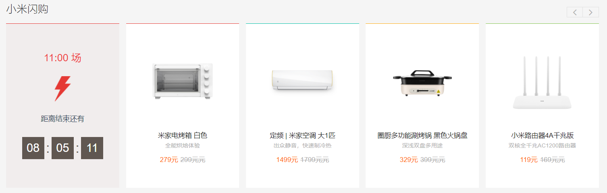
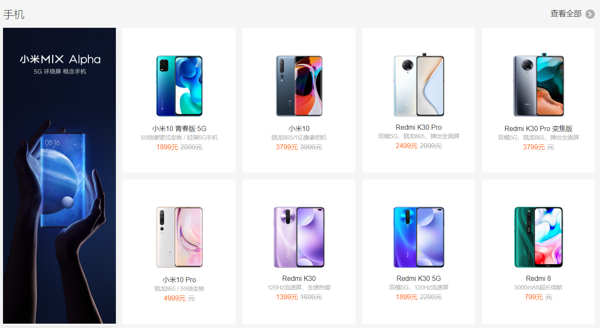
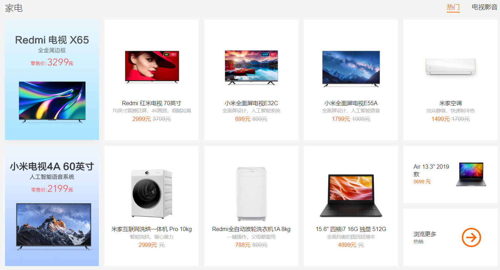
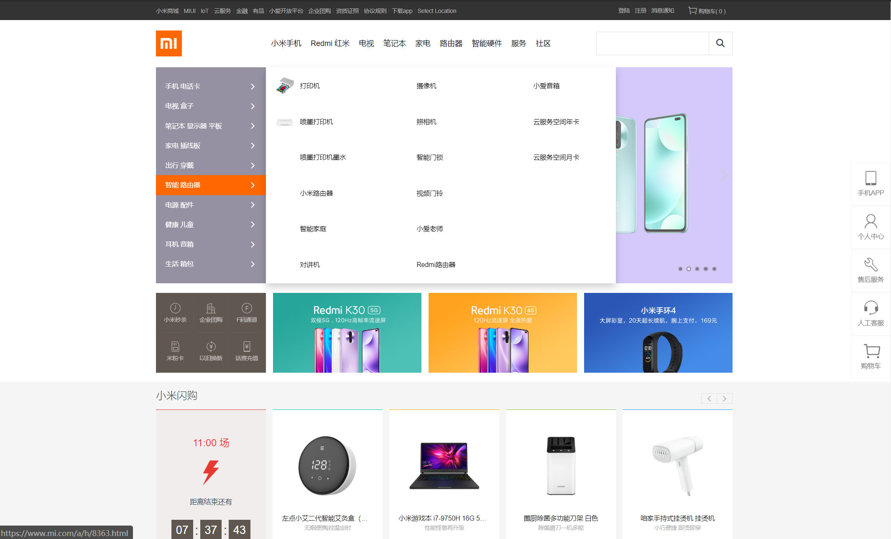
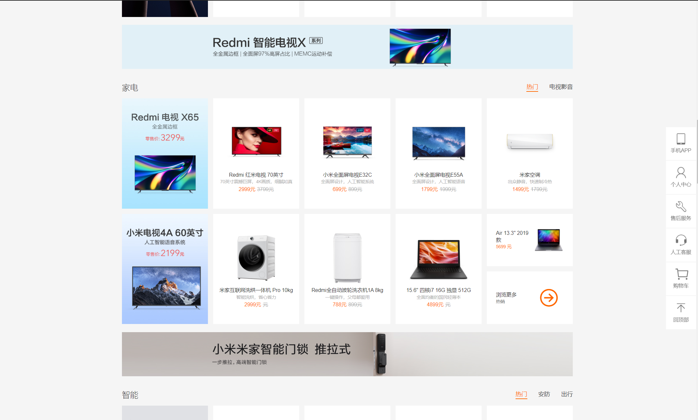

# xiaomi-onlineshop-vue

## 项目介绍 

该项目使用 vue 和 vue-cli 实现了小米商场网页版的主界面。

## 技术栈

CSS3/CSS5, HTML/HTML5, ES5/ES6, Vue，Vuex, Vue-cli，Sass 等。
 
## 项目特点

项目实现参考了小米商城主页面的代码，并进行了主关的修改和优化：

### 01 轮播图上方分类展示详情页

使用 flex 布局对该区域进行了重新的排版。 

### 02 小米闪购轮播模块功能改进

小米官方网站闪购模块中的闪购商品轮播模块在商品轮播结束之后直接从最后一个快速移动到第一个商品（这是开始开发时候的效果，现在已经改了，没这么抽了，但是仍有不太好的地方，之后会介绍）。

这样的效果我个人感觉很不友好，即使要回到最开始的位置也不应该如此快速的切换，造成一堆产品展示盒子一闪而过的情况。

目前官网已经更改了这个效果，更改之后的效果是轮播结束，停留在该界面，除非用户点击切换上一页的按钮。

我的改进方案是：
    自动轮播结束之后，逆序轮播直到回到最开始的子页面，然后再进行正向轮播，如此循环往复。

### 03 重构了手机商品展示和其它商品展示组件

小米官网的展示模块的手机和家电等其它模块的样式区别较大，因此使用的是不同的模块文件，但本质上他们都是商品展示的模块，因此我将他们重构到了一套模板(使用 grid 布局)中。

### 04 修改了侧边工具的样式

单纯的觉得官网的侧边工具的样式比较丑，因此做了一定的修改。

## 项目不足

1. sass 相关功能运用的不多，只是用了部分简单的语法，还有很大的改进空间；
2. 没有设置 max/min-width 等属性，后续可以配合 @media 实现响应式布局；
3. 没有实现复杂的数据交换的功能。 

## 项目总结
1. 通过这次开发过程熟悉了使用 vue-cli 开发一套代码的流程和一些注意事项；
2. 进一步深化了自己对 CSS3 新特性( flex, grid, transform 等)的理解；
3. 开发过程遇到了关于 flex 和 grid 布局的两个很奇葩的问题，查阅了 MDN 和 stackoverflow 相关问答之后发现都是设计时的遗留问题。但是悲剧的是，这个项目完成已经有一段时间了，我已经记不清楚具体的问题了。当时手里一堆其它笔记也没有这个问题进行记录和整理，想想以后遇到同样的问题的时候还有四处查阅就难受。希望之后我和大家一样能在遇到问题的时候及时记录和整理。

以上项目作为我学习前端的第一个完成度比较高的项目肯定还有很多不足甚至错误指出，如果您能发现也请不吝赐教。
